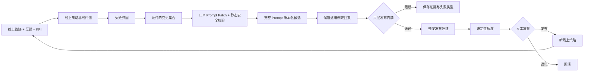
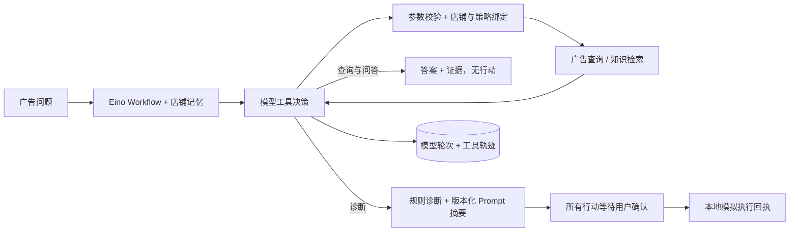

<div align="center">

# ⚡ EvoOps

### 面向广告 ROI 的受控自进化 Agent

**决策可追溯 · 同链路回放 · Prompt 演进 · 人工受控执行**

<p>
  <a href="README.en.md"></a>
  <a href="README.md"></a>
</p>

<p>
  
  
  
  
  <a href="LICENSE"></a>
</p>

[项目亮点](#项目亮点) · [自进化闭环](#自进化闭环) · [评测体系](#evaluation-harness) · [运行架构](#运行架构) · [快速开始](#快速开始) · [API](#http-api)

</div>

---

EvoOps 是一个基于 Go 与 [CloudWeGo Eino](https://github.com/cloudwego/eino) 构建的、轨迹可追溯的广告 ROI 自进化 Agent。配置模型后，它通过原生 Tool Calling 按需查询广告数据、检索知识，区分知识问答、数据查询和广告诊断。诊断使用版本化 ROI 阈值生成候选行动；模型驱动模式下，创建复核任务和暂停广告都需要用户确认。项目重点是将执行轨迹转化为受约束策略候选，并由六层 Evaluation Harness 阻断不安全或退化版本。

仓库内置 4 个合成商店用例，分别覆盖健康投放、已暂停计划、投放中低 ROI 计划和店铺级偏好记忆。框架边界可复用于其他“决策 + 执行”型 Agent，同时保持当前 Demo 的广告 ROI 场景足够聚焦。

## 一眼看懂

| 能力 | 实现方式 |
|---|---|
| Agent 运行时 | Go + Eino Workflow，内嵌有预算的原生 Tool Calling 循环 |
| 自进化对象 | 版本化 Prompt 产物与白名单策略参数 |
| 评测体系 | 六层 Evaluation Harness + 独立 LLM-as-Verifier/Judge |
| 检索链路 | Dense + BM25、加权 RRF、父子块自动合并、重排 |
| 反馈学习 | 基于显式反馈与 KPI 结果构建店铺级长期记忆 |
| 发布治理 | 不可变安全边界、审批门禁、灰度、发布凭证与回滚 |

## 项目亮点

- **模型自主工具选择：** Eino `WithTools` → 原生 `tool_calls` → 参数/白名单校验 → `tool` 结果回传。只读工具开放给模型，店铺和策略由程序注入；查询不产生行动，诊断行动全部需确认。
- **同链路回放：** Harness 调用与在线 Agent 相同的 Eino Workflow 和工具循环，禁止执行副作用；双回放检查实际稳定性，不假定模型决策完全确定。
- **完整执行轨迹：** 持久化每个节点、工具输入输出、检索排序、耗时、证据引用、行动状态、策略版本和审批事件。
- **商家记忆与反馈学习：** 将明确的行动反馈和标准化 KPI 结果沉淀为租户隔离、来源可追溯的记忆事实；记忆只影响后续方案排序，不改变风险等级，也不能绕过审批。
- **混合分层检索：** 采用确定性稠密检索与 BM25 双路召回，通过加权 RRF 融合，并支持父子块自动合并、业务短语重排和策略控制的查询改写。
- **六层评测 Harness：** 分别评测检索、轨迹、工具安全、业务效果、LLM Verifier/Judge 质量以及成本/时延；安全、可复现性与事实有据性均为硬门禁。
- **受控 Prompt 自进化：** 将失败归因和 Judge 反馈交给 Eino Prompt Optimizer，生成边界受限的 Prompt Patch；在候选回放前持久化完整 Prompt、父版本、模型、演进理由、证据与静态校验结果。审批、证据、记忆和工具权限边界不可被改写。
- **发布凭证：** 通过评测的策略会记录 Harness 报告、评测集版本及其对比的线上基线；过期候选无法进入灰度或正式发布。
- **人工控制：** 中高风险操作持久化暂停；灰度分流确定性可复现；正式发布必须显式确认；回滚恢复上一稳定版本。
- **离线可运行：** 无模型 Key 时仍可执行确定性诊断和前五层结构化评测；配置模型后，由独立 Eino 模型生成回答，并由 Qwen Max 核验事实和评价回答质量。

检索与可观测性设计延续自我此前的 [MedQA-Agentic-RAG](https://github.com/inv1sion/MedQA-Agentic-RAG) 项目。EvoOps 使用 Go/Eino 重新实现在线链路，并新增自进化 Harness、策略治理、发布门禁和电商广告评测集。

## 自进化闭环



这里的“自进化”指受治理的优化，而不是让模型不受约束地修改源代码。每次候选变更都必须小范围、可解释、可回放、可回滚。

## Evaluation Harness

| 评测层 | 测量内容 | 门禁方式 |
|---|---|---|
| 检索质量 | Precision@K、Recall@K、MRR、NDCG、改写使用和检索成本 | 最低召回率与质量分 |
| 轨迹质量 | Eino 节点顺序、必要工具召回、步骤/工具预算、错误、双回放指纹 | 硬门禁 |
| 工具安全 | 可能绕过审批的禁止操作 | 硬门禁，任一违规即阻断 |
| 业务效果 | 信号 F1、行动 F1、加权业务效用覆盖率 | 最低业务质量分 |
| 模型质量 | 事实有据、数字准确、行动支持、完整性、审批说明 | 硬门禁，无依据或数字错误即阻断 |
| 成本性能 | 工具/模型/检索成本单位及端到端节点耗时 | 策略级与用例级预算 |

候选版本还必须满足相对于最新线上基线的总分和分层退化容忍度。Schema、公式及扩展方法见 [docs/harness.md](docs/harness.md)。

每次演进都会保存紧凑的基线/候选对照结果：用例通过率、模型质量、事实有据、数字准确、平均工作流耗时、成本单位、安全违规、Prompt 血缘和门禁决策。真实的 4 用例 Qwen 实验记录在 [docs/evaluation-results.md](docs/evaluation-results.md)；它证明的是一个不退化且通过门禁的 Prompt 变更，而不是从已经满分的合成基线虚构质量提升。

## 运行架构

详细的输入输出、工具协议、错误边界和例子见 [Tool Calling 运行说明](docs/tool-calling.md)。工具决策 Prompt 当前是独立代码版本，**尚未纳入自动 Prompt 进化**。



Agent 可以通过 Eino 官方 MCP 适配器发现白名单内的 MCP SSE 工具，但不会把注册表里的所有工具自动暴露给模型。本地 Demo 使用身份请求头模拟授权边界；真实部署应替换为已验证的 OIDC/JWT Claim 和租户级工具策略。无 Key 或关闭 Tool Calling 时保留原固定诊断流程，低风险任务仍按旧模式执行。

有 Key 时默认启用 `EVOOPS_TOOL_CALLING_ENABLED=true`；可显式设为 `false` 比较固定流程。运行失败不会静默切换模式。新增模型调用计入 Harness 成本，原来的低成本预算可能阻断新链路，历史评测结果不代表新链路结果。

## 快速开始

要求 Go 1.25 或更高版本。

```bash
go test ./...
go run ./cmd/evoops demo
go run ./cmd/evoops harness
go run ./cmd/evoops evolve -canary 10
go run ./cmd/evoops serve
```

打开 <http://localhost:8080>。主流程和记忆学习使用 `demo-store`；也可以使用 `healthy-store`、`paused-store` 和 `low-roi-store` 运行隔离用例。

控制台默认进入中文**广告助手**。切换到 **Agent 实验室**后，可以检查证据链、模型工具调用轮次、Eino 执行轨迹、租户级记忆和持久化自进化报告。README 顶部提供中文与 English 文档切换。

`evolve` 命令执行以下闭环：

```text
线上策略基线回放
  → 失败归因
  → LLM 生成 Prompt Patch
  → 不可变边界校验
  → 白名单策略变更与完整 Prompt 产物
  → 每个用例执行两次候选回放
  → 基线与分层退化门禁
  → 可选灰度
```

系统不会自动正式发布。通过评测并进入灰度后，仍需要独立的管理员操作才能提升为线上版本。

仓库默认使用阿里云百炼 OpenAI 兼容接口。在线 Agent 使用 `qwen3.7-flash-2026-07-15`，独立 Verifier/Judge 使用 `qwen3.7-max-2026-06-08`。请把凭据放入已被 Git 忽略的本地 `.env`，或使用进程环境变量注入：

```bash
export OPENAI_API_KEY=your-key
go run ./cmd/evoops serve
```

PowerShell 使用 `$env:OPENAI_API_KEY = "..."`，不要使用 `export`。进程环境变量优先于 `.env`；`OPENAI_BASE_URL`、`OPENAI_MODEL`、`EVOOPS_JUDGE_MODEL`、`EVOOPS_PROMPT_OPTIMIZER_MODEL` 和 `EVOOPS_LLM_EVAL_ENABLED` 可用于部署时覆盖。Prompt Optimizer 默认复用 `OPENAI_MODEL`。切勿提交真实 Key；`.env` 已被 Git 和 Docker 构建上下文排除。

## 常用命令

```bash
# 评测当前线上策略
go run ./cmd/evoops harness

# 使用最新线上基线评测指定候选
go run ./cmd/evoops harness -policy CANDIDATE_VERSION

# 运行闭环；通过后分配 10% 确定性灰度流量
go run ./cmd/evoops evolve -canary 10

# 验证仓库工程状态
go test ./...
go vet ./...
go build ./cmd/evoops
```

## HTTP API

| 方法 | 接口 | 用途 |
|---|---|---|
| `POST` | `/api/runs` | 运行在线诊断 |
| `POST` | `/api/runs/stream` | 通过 SSE 接收运行事件 |
| `GET` | `/api/runs/{id}` | 读取完整执行轨迹 |
| `POST` | `/api/runs/{id}/approve` | 恢复或拒绝受门禁保护的行动 |
| `POST` | `/api/runs/{id}/feedback` | 保存有效性、行动和 KPI 反馈 |
| `GET` | `/api/stores/{id}/memory` | 读取租户级可审计记忆画像 |
| `GET` | `/api/harness/reports` | 查询持久化分层评测报告 |
| `POST` | `/api/harness/run/{version}` | 将指定策略与线上基线对比评测 |
| `POST` | `/api/evolution/run` | 执行归因 → 候选 → Harness → 可选灰度 |
| `GET` | `/api/evolution/runs` | 查询完整演进记录 |
| `POST` | `/api/evolution/canary/{version}` | 分配确定性灰度流量 |
| `POST` | `/api/evolution/promote/{version}` | 使用有效发布凭证提升灰度策略 |
| `POST` | `/api/evolution/rollback` | 恢复上一线上策略 |

审批示例：

```bash
curl -X POST http://localhost:8080/api/runs/RUN_ID/approve \
  -H 'Content-Type: application/json' \
  -H 'X-EvoOps-Role: approver' \
  -H 'X-EvoOps-Actor: reviewer@example.com' \
  -d '{"approved":true,"reason":"metrics and scope reviewed"}'
```

## MCP 工具

```bash
export EVOOPS_MCP_SSE_URLS=http://localhost:3001/sse,http://localhost:3002/sse
export EVOOPS_MCP_TOOL_ALLOWLIST=lookup_order,create_ticket
```

发现后的工具进入与本地工具相同的 Eino Registry。生产系统应在工具发现阶段执行白名单约束，并在调用阶段再次校验身份、授权和参数策略。

## 目录结构

```text
cmd/evoops/             CLI 与 HTTP 入口
data/demo/              合成广告数据与广告处置手册
data/harness/           版本化标注评测用例
docs/                   架构、Harness、自进化与决策记录
internal/agent/         Eino Workflow、回放模式、诊断与总结
internal/memory/        反馈到记忆的学习与租户级画像
internal/retrieval/     Dense + BM25 + RRF + 自动合并 + 重排
internal/harness/       确定性评分、LLM Verifier/Judge、指纹与归因
internal/evolution/     基线/候选评测与发布闭环
internal/prompt/        LLM Prompt Patch、不可变组合与静态校验
internal/policy/        变更约束、发布凭证、灰度与回滚
internal/repository/    原子 JSON 轨迹/报告/策略持久化
internal/httpapi/       API、角色门禁与内嵌运营控制台
internal/tools/         类型化 Eino 工具与 MCP 发现
```

## 工程边界

本地语料与哈希稠密向量器保证 CI 可复现；检索器接口可以替换为 Embedding 服务和向量数据库，同时保留相同的检索轨迹与 Harness 契约。文件仓库采用加锁原子替换；多实例部署可自然演进为 PostgreSQL、分布式检查点和任务队列。SSE Demo 当前缓冲完整轨迹后输出；生产流式链路应对接实时 Workflow Callback。

详细设计见 [docs/architecture.md](docs/architecture.md)、[docs/self-evolution.md](docs/self-evolution.md) 和 [docs/decision-log.md](docs/decision-log.md)。

## License

Apache-2.0，详见 [LICENSE](LICENSE)。
