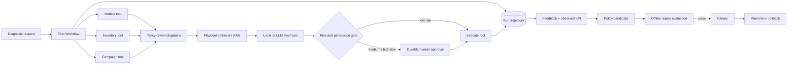

# EvoOps

EvoOps is a traceable, policy-evolving operations agent built with Go and [CloudWeGo Eino](https://github.com/cloudwego/eino). It turns business metrics into evidence-linked diagnoses and guarded actions, then uses feedback and outcome data to propose safer policy improvements.

It is intentionally domain-neutral at the framework layer. The included synthetic commerce store makes the workflow concrete without coupling the architecture to one company or internal system.

## What it demonstrates

- **Eino workflow orchestration** — a compiled `compose.Workflow` coordinates data gathering, diagnosis, retrieval, synthesis, and execution gating.
- **Eino tools and MCP** — local tools use Eino's typed tool abstraction; optional MCP SSE servers are discovered with the official MCP adapter and added to the same registry.
- **RAG with evidence lineage** — playbooks are retrieved after signal detection, and every conclusion carries stable evidence IDs.
- **Durable trajectory** — each run stores node input/output, tool arguments/results, latency, policy version, evidence, and approval events.
- **Human-in-the-loop execution** — low-risk diagnostic tasks may execute automatically; medium/high-risk operations pause in a durable approval state.
- **Permission gates** — approval requires an `approver` or `admin` role; canary, promotion, and rollback require `admin`.
- **Controlled self-evolution** — feedback generates policy candidates, never arbitrary code changes. Candidates must pass offline replay and safety gates before canary traffic.
- **Model-optional operation** — the deterministic analyzer makes the entire demo and test suite work without an API key. An OpenAI-compatible Eino model can synthesize the final narrative.

## Architecture



More detail is in [docs/architecture.md](docs/architecture.md) and the base-project decision is recorded in [docs/decision-log.md](docs/decision-log.md).

## Quick start

Requirements: Go 1.24 or newer.

```bash
go test ./...
go run ./cmd/evoops demo
go run ./cmd/evoops demo -approve
go run ./cmd/evoops serve
```

Open <http://localhost:8080>. The default store is `demo-store`.

No API key is required. To use a real OpenAI-compatible model:

```bash
export OPENAI_API_KEY=your-key
export OPENAI_BASE_URL=https://your-compatible-endpoint/v1
export OPENAI_MODEL=your-model
go run ./cmd/evoops serve
```

On PowerShell, use `$env:OPENAI_API_KEY = "..."` instead of `export`.

## Controlled evolution demo

```bash
# Generate a candidate, run all replay cases, and start a 10% canary only if it passes.
go run ./cmd/evoops evolve -canary 10
```

The command does **not** auto-promote. Promotion stays a separate admin action so an apparently good offline score cannot silently replace production policy.

The evolution unit is a versioned policy containing:

- anomaly thresholds;
- approval risk threshold;
- retrieval depth;
- prompt revision and routing metadata.

Application source code, tool implementations, and permission rules are outside the self-modifying boundary.

## HTTP API

| Method | Endpoint | Purpose |
|---|---|---|
| `POST` | `/api/runs` | Run a diagnosis |
| `POST` | `/api/runs/stream` | Receive a run as SSE events |
| `GET` | `/api/runs/{id}` | Read the full trajectory |
| `POST` | `/api/runs/{id}/approve` | Resume or reject guarded actions |
| `POST` | `/api/runs/{id}/feedback` | Store usefulness, action, and KPI feedback |
| `POST` | `/api/evolution/candidates` | Generate a policy candidate |
| `POST` | `/api/evolution/evaluate/{version}` | Run the offline replay gate |
| `POST` | `/api/evolution/canary/{version}` | Assign deterministic canary traffic |
| `POST` | `/api/evolution/promote/{version}` | Promote an evaluated/canary policy |
| `POST` | `/api/evolution/rollback` | Restore the previous active policy |

Approval example:

```bash
curl -X POST http://localhost:8080/api/runs/RUN_ID/approve \
  -H 'Content-Type: application/json' \
  -H 'X-EvoOps-Role: approver' \
  -H 'X-EvoOps-Actor: reviewer@example.com' \
  -d '{"approved":true,"reason":"metrics and scope reviewed"}'
```

The header-based identity is a local-demo adapter, not a production authentication system. Replace it with verified JWT/OIDC claims at the HTTP boundary; the domain gate can remain unchanged.

## MCP tools

Connect one or more MCP SSE endpoints:

```bash
export EVOOPS_MCP_SSE_URLS=http://localhost:3001/sse,http://localhost:3002/sse
export EVOOPS_MCP_TOOL_ALLOWLIST=lookup_order,create_ticket
```

EvoOps initializes the official MCP client, discovers allowed tools, converts them to Eino tools, and exposes them through `/api/tools`. Production deployments should always set an allowlist and apply the same risk classification used for local execution tools.

## Repository layout

```text
cmd/evoops/             CLI and HTTP entry point
data/demo/              synthetic store and replay cases
docs/                   architecture and engineering decisions
internal/agent/         Eino workflow, diagnosis and model adapter
internal/dataset/       business data and operation adapter
internal/evolution/     candidate generation and replay evaluation
internal/httpapi/       API, RBAC gate and embedded trajectory UI
internal/policy/        version selection, canary, promotion, rollback
internal/repository/    durable JSON run/policy/feedback/eval store
internal/tools/         Eino local tools and MCP discovery
```

## Quality checks

```bash
go test ./...
go vet ./...
go build ./cmd/evoops
```

The tests cover healthy/anomalous diagnosis, guarded execution and approval resume, durable traces, repository persistence, permission enforcement, replay evaluation, canary promotion, and rollback.

## Production extensions

The MVP keeps infrastructure local so it is easy to inspect. The next production-oriented increments are PostgreSQL-backed storage, Redis/distributed checkpointing, OpenTelemetry export, JWT/OIDC authorization, live rather than buffered SSE events, embedding/vector retrieval, outcome-window scheduling, and load/fault testing.

## License

Apache-2.0. See [LICENSE](LICENSE).

