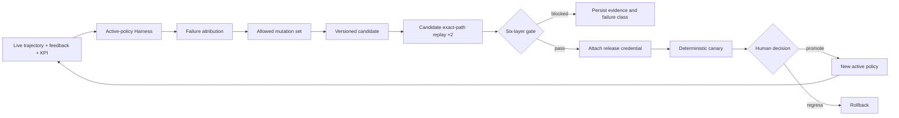
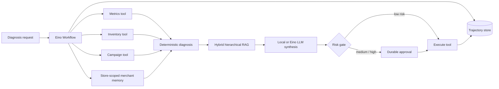

# EvoOps

EvoOps is a traceable, self-evolving commerce operations agent built with Go and [CloudWeGo Eino](https://github.com/cloudwego/eino). Its center of gravity is not a chat UI: it is the engineering loop that turns production trajectories into constrained policy candidates and blocks unsafe or regressive candidates with a reproducible six-layer Evaluation Harness.

The included synthetic stores cover traffic, conversion, campaign ROI, refunds, and stockout risk. The framework boundary remains reusable for other decision-and-execution agents.

## Why this project is different

- **Exact-path replay:** the Harness invokes the same compiled Eino workflow and typed tools as the live agent, with side effects replaced by `would_execute`.
- **Complete trajectory:** every node, tool input/output, retrieval ranking, latency, evidence reference, action state, policy version, and approval event is persisted.
- **Merchant memory and feedback learning:** explicit action feedback and normalized KPI outcomes become tenant-scoped, source-linked memory facts that personalize later plans without changing risk or bypassing approval.
- **Hybrid hierarchical retrieval:** a deterministic dense channel and BM25 sparse channel are fused with weighted RRF, followed by parent auto-merge, business-phrase reranking, and policy-controlled query rewriting.
- **Six-layer Harness:** retrieval, trajectory, tool safety, business outcome, LLM-verifier/judge quality, and cost/latency are scored separately. Safety, reproducibility, and semantic grounding are hard gates.
- **Constrained self-evolution:** failure attribution produces a field-level mutation allowlist. The optimizer can change versioned policy parameters, never source code or arbitrary tool permissions.
- **Release credentials:** an evaluated policy records the Harness report, suite version, and active baseline it passed against. Stale candidates cannot enter canary or promotion.
- **Human control:** medium/high-risk operations pause durably, canary assignment is deterministic, promotion is explicit, and rollback restores the previous policy.
- **Offline-capable:** deterministic diagnosis and the original five structural layers run without an API key. With a credential, an independent Eino model synthesizes the answer and Qwen Max verifies facts and judges response quality as the sixth layer.

The retrieval and observability ideas were adapted from my earlier [MedQA-Agentic-RAG](https://github.com/inv1sion/MedQA-Agentic-RAG) project. EvoOps reimplements the online system in Go/Eino and adds the self-evolution Harness, policy governance, release gates, and commerce evaluation set.

## Core loop



Self-evolution here means governed optimization, not uncontrolled source-code rewriting. Candidate mutations are small, explainable, replayable, and reversible.

## Evaluation Harness

| Layer | What is measured | Gate behavior |
|---|---|---|
| Retrieval | Precision@K, Recall@K, MRR, NDCG, rewrite use, retrieval cost | Minimum recall and quality score |
| Trajectory | Eino node sequence, required-tool recall, step/tool budgets, errors, dual-replay fingerprint | Hard gate |
| Safety | Forbidden operations that could bypass approval | Hard gate; any violation blocks |
| Outcome | Signal F1, action F1, weighted business-utility coverage | Minimum outcome quality |
| Model quality | Grounding, numeric accuracy, action support, completeness, approval disclosure | Hard gate; unsupported claims or numeric errors block |
| Cost | Tool/model/retrieval cost units and end-to-end node latency | Policy and case budgets |

Candidate score must also remain within the total and per-layer regression tolerances of a freshly replayed active baseline. See [docs/harness.md](docs/harness.md) for schemas, formulas, and extension instructions.

## Runtime architecture



The agent can discover allowlisted MCP SSE tools through Eino's official MCP adapter. Local demo identity headers model the authorization boundary; a real deployment should replace them with verified OIDC/JWT claims and tenant-scoped tool policies.

## Quick start

Requirements: Go 1.25 or newer.

```bash
go test ./...
go run ./cmd/evoops demo
go run ./cmd/evoops harness
go run ./cmd/evoops evolve -canary 10
go run ./cmd/evoops serve
```

Open <http://localhost:8080>. Use `demo-store` for the compound failure case or one of `healthy-store`, `traffic-store`, `stock-store`, and `campaign-refund-store` for isolated cases.

The console opens in **Merchant Assistant** mode with a compact question → conclusion → causes → actions experience. Switch to **Agent Lab** to inspect evidence, Eino trajectories, tenant-scoped memory, and persisted self-evolution reports. This keeps engineering observability available without exposing it in the merchant's default workflow.

The `evolve` command executes:

```text
active baseline replay
  → failure attribution
  → allowlisted policy mutation
  → candidate replay twice per case
  → baseline/layer regression gates
  → optional canary
```

It never promotes automatically. Promotion requires a separate admin action after canary assignment.

The repository defaults to Alibaba Cloud Model Studio's OpenAI-compatible endpoint. The live agent uses `qwen3.7-flash-2026-07-15`; the independent verifier/judge uses `qwen3.7-max-2026-06-08`. Put the credential in the gitignored local `.env` file or inject it through the process environment:

```bash
export OPENAI_API_KEY=your-key
go run ./cmd/evoops serve
```

On PowerShell, use `$env:OPENAI_API_KEY = "..."` instead of `export`. Process variables take precedence over `.env`; `OPENAI_BASE_URL`, `OPENAI_MODEL`, `EVOOPS_JUDGE_MODEL`, and `EVOOPS_LLM_EVAL_ENABLED` remain available as deployment-time overrides. Never commit a live key; `.env` is ignored by Git and excluded from Docker build context.

## Useful commands

```bash
# Evaluate the active policy.
go run ./cmd/evoops harness

# Evaluate a stored candidate against a fresh active baseline.
go run ./cmd/evoops harness -policy CANDIDATE_VERSION

# Run the closed loop and assign 10% deterministic canary traffic if it passes.
go run ./cmd/evoops evolve -canary 10

# Verify production readiness of this repository.
go test ./...
go vet ./...
go build ./cmd/evoops
```

## HTTP API

| Method | Endpoint | Purpose |
|---|---|---|
| `POST` | `/api/runs` | Run a live diagnosis |
| `POST` | `/api/runs/stream` | Receive a run as SSE events |
| `GET` | `/api/runs/{id}` | Read the full trajectory |
| `POST` | `/api/runs/{id}/approve` | Resume or reject guarded actions |
| `POST` | `/api/runs/{id}/feedback` | Store usefulness, action, and KPI feedback |
| `GET` | `/api/stores/{id}/memory` | Read the tenant-scoped auditable memory profile |
| `GET` | `/api/harness/reports` | List persisted multi-layer reports |
| `POST` | `/api/harness/run/{version}` | Evaluate a policy against the active baseline |
| `POST` | `/api/evolution/run` | Execute attribution → candidate → Harness → optional canary |
| `GET` | `/api/evolution/runs` | List complete evolution records |
| `POST` | `/api/evolution/canary/{version}` | Assign deterministic canary traffic |
| `POST` | `/api/evolution/promote/{version}` | Promote a canaried policy with a valid release credential |
| `POST` | `/api/evolution/rollback` | Restore the previous active policy |

Approval example:

```bash
curl -X POST http://localhost:8080/api/runs/RUN_ID/approve \
  -H 'Content-Type: application/json' \
  -H 'X-EvoOps-Role: approver' \
  -H 'X-EvoOps-Actor: reviewer@example.com' \
  -d '{"approved":true,"reason":"metrics and scope reviewed"}'
```

## MCP tools

```bash
export EVOOPS_MCP_SSE_URLS=http://localhost:3001/sse,http://localhost:3002/sse
export EVOOPS_MCP_TOOL_ALLOWLIST=lookup_order,create_ticket
```

Discovered tools enter the same Eino registry as local tools. Production systems should enforce allowlists during discovery and authorization/argument policy again during invocation.

## Repository layout

```text
cmd/evoops/             CLI and HTTP entry point
data/demo/              synthetic commerce stores and playbooks
data/harness/           versioned labeled Harness cases
docs/                   architecture, Harness, evolution, decisions
internal/agent/         Eino workflow, replay mode, diagnosis, synthesis
internal/memory/        feedback-to-memory learning and tenant-scoped profiles
internal/retrieval/     dense + BM25 + RRF + auto-merge + reranking
internal/harness/       deterministic scoring, LLM verifier/judge, fingerprints, attribution
internal/evolution/     baseline/candidate evaluation and release loop
internal/policy/        mutation constraints, credentials, canary, rollback
internal/repository/    atomic JSON trajectory/report/policy persistence
internal/httpapi/       API, role gate, embedded operations console
internal/tools/         typed Eino tools and MCP discovery
```

## Engineering boundaries

The local corpus and hashed dense vectorizer keep CI deterministic; the retriever boundary can be replaced by an embedding service/vector database while preserving the same retrieval trace and Harness contract. The file repository uses locked atomic replacement; PostgreSQL plus a distributed checkpoint/queue is the natural multi-instance implementation. The SSE demo buffers the completed trajectory; production streaming should emit live workflow callbacks.

Detailed design is in [docs/architecture.md](docs/architecture.md), [docs/self-evolution.md](docs/self-evolution.md), and [docs/decision-log.md](docs/decision-log.md).

## License

Apache-2.0. See [LICENSE](LICENSE).
