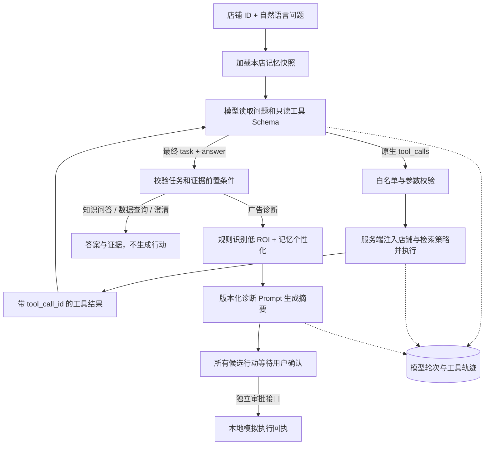

# 模型驱动的 Tool Calling

## 实际改变了什么

有模型 Key 且 `EVOOPS_TOOL_CALLING_ENABLED=true`（默认）时，EvoOps 使用 Eino `ChatModel.WithTools` 向模型发送两种只读工具的 Schema，处理原生 `tool_calls`，并将实际结果作为带相同 `tool_call_id` 的 `tool` 消息回传。不是让模型输出一段伪工具调用文本。

外层仍是编译后的 Eino Workflow，内部工具选择循环由应用代码显式控制。没有改成 Eino 预置 ReAct Agent，也没有引入框架级图 State；节点继续传递每次请求独立的 `execution`。

无 Key 或显式关闭开关时保留原来的固定诊断流程。已启用的工具调用模型失败时**不会静默切回固定流程**；失败运行保留轨迹。诊断摘要模型原有的确定性降级仍保留，并在轨迹记录错误。

## 整体数据流



五个外层节点依次是 `load_merchant_memory`、`model_tool_collection`、`diagnose_campaign_roi`、`synthesize_ad_plan`、`approval_and_execution_gate`。非诊断任务在后三个节点仅整理结果并跳过诊断、额外生成和操作。

## 输入与输出

默认输入仍然简单：

```json
{"store_id":"demo-store","question":"帮我诊断哪些广告 ROI 偏低，并结合处置手册给出建议。"}
```

可选 `task` 为 `auto`（默认）、`diagnosis`、`data_query`、`knowledge_qa`。它是任务约束，不是权限凭证；模型选择 diagnosis 也不能授权执行。评测套件显式指定 diagnosis，意图选择则由独立测试覆盖。

模型可调用的工具：

| 工具 | 模型能传的参数 | 程序补充的参数 |
|---|---|---|
| `get_campaign_performance` | `{}` | 本次请求绑定的 `store_id` |
| `search_operations_knowledge` | `{"query":"低 ROI 广告处置"}` | `store_id`、TopK、召回/融合/重排等策略 |

模型不能指定别的店铺、风险阈值、审批规则或检索策略；注册表里的执行工具和外部 MCP 工具不会自动暴露给它。这里的店铺绑定仅防止模型改变本次请求范围，**HTTP 入口仍是本地 Demo，尚未实现生产级登录和租户鉴权**。

每轮可以请求一个或多个工具；同一轮请求由程序串行处理，然后一起进入下一次模型调用。最终模型返回 `task` 与 `answer` 的 JSON：

- `data_query`：必须成功读取广告数据；保留数据证据，直接展示回答，无行动。
- `knowledge_qa`：必须成功检索知识；保留知识证据，直接展示回答，无行动。
- `diagnosis`：必须成功读取广告数据、完成知识检索。模型的最终 answer 不作为诊断结果；由代码比较 ROI 阈值、形成信号/行动，再由原来的版本化诊断 Prompt 生成摘要。
- `clarify`：请用户补充信息或解释限制，无行动。

模型选择任务仍可能出错；当前保护能阻止未确认执行，不能证明任务分类和回答永远正确。知识检索无命中不等于工具失败，更不等于有充分证据：摘要需诚实说明证据边界。

## 同一个入口的三个例子

1. “ROI 是什么意思？” → 知识检索 → 知识解释。不会为了这个问题查询店铺广告。
2. “只列出各广告计划 ROI 和消耗，不要处置建议。” → 广告查询 → 指标回答。即使 ROI 低也不会生成暂停行动。
3. “诊断哪些广告效果差，结合手册给建议。” → 模型选择数据查询和知识检索（可同一轮，也可分轮）→ 规则诊断 → 摘要 → 待确认行动。

数据仍来自 `data/demo/store.json`，没有接入真实广告平台；`window_days` 尚不驱动按日期查询。RAG 默认使用本地哈希稠密检索以保证 CI 可复现；设置 `EVOOPS_RAG_BACKEND=external` 后，同一个 Tool 会切换到 text-embedding-v3、Milvus BM25、Qwen Rerank、PostgreSQL 父块与 Redis 缓存，详见 [分层混合 RAG](rag.md)。商家记忆仍使用本地 JSON 文件。

## 执行与错误边界

- 6 轮模型调用、4 次工具申请、最多 2 次错误修正机会。策略中的更小工具预算也生效。
- 工具循环总时限 120 秒，单次模型客户端超时 45 秒，只读工具子上下文超时 10 秒。适配器需遵守 context，无法强制终止不配合取消的第三方代码。
- 参数必须是 JSON 对象；拒绝未知字段、重复键、null、类型错误、尾随 JSON。查询长度 1–256 字符，参数不超过 2 KiB。
- 结果不超过 32 KiB，否则返回可见错误而非截断成损坏 JSON。当前是大小限制，不是摘要压缩。
- 成功的相同查询使用本次运行内缓存；第二次重复命中触发停止。失败读取可由模型在预算内重试，目前没有指数退避、HTTP 错误分类或熔断器。
- 校验失败通过结构化 `tool` 错误消息交回模型。写工具或未知工具请求直接拒绝；错误不会被伪装为空数据。
- 缺必要成功读取时，不接受诊断或数据答案。超预算、模型错误或无法修正时，运行标记失败并保存已有轨迹。
- **模型驱动模式下，包括低风险复核任务在内的全部执行行动，都需要独立用户确认。** 固定流程仍按原风险阈值审批。审批接口还使用本地演示身份头，并非生产级审批系统。

## 界面与轨迹

页面顶部显示“模型工具调用已启用”或“固定工作流模式”。回答旁显示任务类型。Agent 实验室 → 执行轨迹 → “模型自主选择工具”可以看到每一轮选择了什么工具，展开技术载荷查看：

- `model_turns`：轮次、调用耗时、工具申请、最终输出、错误、供应商返回的 Token 用量（不保存私有思维链）。
- `tool_calls`：调用 ID、模型原始参数、服务端实际参数、结果、缓存命中、耗时及错误码。
- `execution_mode`：模型驱动或固定 Workflow，避免将离线模式误当作真实模型调用。

失败 HTTP 响应也返回 `run`，界面保留已发生的轨迹。当前页面仍在完整请求结束后展示轨迹，不是逐 Token/逐轮实时流式推送。

## 自进化和 Harness 的关系

新工具循环已进入真实诊断链路与 Harness 回放；回放不会调用执行工具。套件版本升级到 `ad-roi-harness-v2-tool-calling`，同时保留固定与模型驱动模式的显式节点顺序契约。

每一轮模型调用都会计入成本代理单位；合并不同知识查询的召回结果，缓存命中不重复计检索成本。仍保留严格的双回放指纹门禁：工具查询或轮次数变化可能被判为不稳定，不应为了让报告通过而隐藏。原成本预算没有被调高，新模式可能因额外模型调用被成本门禁阻断；需要以独立实验重新制定预算。

**这次没有把工具决策 Prompt 纳入自动进化。** `ad-tool-planner-v1` 由代码版本管理，与现有自动优化的诊断摘要 Prompt 分离。当前自动进化依然针对摘要 Prompt 和已允许的策略参数。后续若优化工具决策 Prompt，需要独立工具选择、参数合法性、终止、任务完成与安全用例，而不是复用摘要分数宣称决策能力提升。

## 验证与启动

```powershell
# 在 evoops 目录执行
& "..\_tooling\go\bin\go.exe" test ./...
& "..\_tooling\go\bin\go.exe" run ./cmd/evoops serve

# 自选问题（默认 task=auto）
& "..\_tooling\go\bin\go.exe" run ./cmd/evoops demo -question "ROI 是什么意思？"

# 显式开启真实模型冒烟测试：使用本地 .env，临时数据目录，绝不审批
$env:EVOOPS_LIVE_TOOL_CALLING_TEST = "1"
& "..\_tooling\go\bin\go.exe" test ./internal/app -run TestLiveToolCalling -v -count=1
Remove-Item Env:EVOOPS_LIVE_TOOL_CALLING_TEST
```

普通单元测试不调用外网。测试包含脚本模型、多轮结果关联、原生兼容 API 请求、只读分流、错误修正、跨店铺/策略参数注入、未知/写工具、重复调用、轮次和工具预算、工具超时/错误/超大结果、回放无副作用等。三类真实模型冒烟测试验证接线和几个典型问题，不代表大样本准确率。

### 2026-09-03 真实模型冒烟记录

复用本地配置的 `qwen3.7-flash-2026-07-15`，最后一次完整测试耗时 33.65 秒：

| 问题类型 | 工具决策模型轮次 | 实际工具 | 行动 |
|---|---:|---|---|
| 知识问答 | 2 | 知识检索 | 0 |
| 数据查询 | 2 | 广告查询 | 0 |
| 低 ROI 诊断 | 2 | 广告查询、知识检索 | 2，均待确认 |

诊断另外调用一次摘要模型，上表的 2 轮仅指工具决策模型。初始测试中诊断曾触发一次工具预算上限并安全失败；补充剩余预算提示和空检索终止说明后，上述三例通过。此记录是小样本联通性检查，不是通过率提升实验，也不替代完整 Harness、故障注入或大样本评测。

接口参考：[Eino 工具定义](https://www.cloudwego.io/docs/eino/core_modules/components/tools_node_guide/how_to_create_a_tool/)、[百炼 Function Calling](https://help.aliyun.com/zh/model-studio/qwen-function-calling)。
